# Enterprise Support Agent Architecture - System Design

## Executive Summary

Production-ready system design for an enterprise support agent serving **1000 daily active users (DAU)** with multi-channel support, intelligent routing, and comprehensive observability. This architecture prioritizes reliability, scalability, and cost-efficiency using a hybrid open-source and managed services approach.

**Key Metrics for 1000 DAU:**
- **Concurrent Sessions**: 50-100 peak
- **Daily Conversations**: 3,000-5,000
- **Message Volume**: 30,000-50,000/day
- **Knowledge Base Size**: 10,000-50,000 documents
- **Average Response Time**: <2s first token
- **Monthly Cost**: $3,000-8,000 (fully loaded)

## System Architecture Overview

```mermaid
graph TB
    subgraph "User Channels"
        WEB[Web Widget]
        SLACK[Slack Bot]
        TEAMS[MS Teams]
        EMAIL[Email Gateway]
        API[REST API]
    end

    subgraph "API Layer"
        LB[Load Balancer<br/>Nginx/HAProxy]
        GATEWAY[API Gateway<br/>Kong/Traefik]
        AUTH[Auth Service<br/>Keycloak/Auth0]
        RATE[Rate Limiter<br/>Redis]
    end

    subgraph "Core Services"
        ROUTER[Request Router<br/>FastAPI]
        AGENT[Agent Runtime<br/>LangGraph/CrewAI]
        ORCH[Orchestrator<br/>Temporal/Prefect]
        TOOLS[Tool Gateway<br/>MCP/Custom]
    end

    subgraph "Intelligence Layer"
        LLM_ROUTER[LLM Router<br/>LiteLLM]
        LOCAL[Local Models<br/>vLLM/Ollama]
        CLOUD[Cloud APIs<br/>OpenAI/Claude]
        EMBED[Embeddings<br/>FastEmbed]
    end

    subgraph "Memory & Context"
        SESSION[Session Store<br/>Redis]
        CONTEXT[Context Manager<br/>MongoDB]
        MEMORY[Long-term Memory<br/>PostgreSQL]
        CACHE[Response Cache<br/>Redis]
    end

    subgraph "Knowledge Base"
        VECTOR[Vector DB<br/>Weaviate/Qdrant]
        GRAPH[Knowledge Graph<br/>Neo4j]
        SEARCH[Full-text Search<br/>Elasticsearch]
        DOCS[Document Store<br/>S3/MinIO]
    end

    subgraph "Analytics & Monitoring"
        METRICS[Metrics Store<br/>Prometheus]
        LOGS[Log Aggregation<br/>Loki]
        TRACES[Distributed Tracing<br/>Jaeger]
        ANALYTICS[Analytics DB<br/>ClickHouse]
        DASH[Dashboards<br/>Grafana]
    end

    subgraph "Support Integration"
        TICKET[Ticketing System<br/>Zendesk/Jira]
        CRM[CRM Integration<br/>Salesforce/HubSpot]
        KNOW[Knowledge Base<br/>Confluence]
        ESCAL[Escalation Queue<br/>RabbitMQ]
    end

    %% User Flow
    WEB --> LB
    SLACK --> LB
    TEAMS --> LB
    EMAIL --> LB
    API --> LB
    
    %% API Layer Flow
    LB --> GATEWAY
    GATEWAY --> AUTH
    GATEWAY --> RATE
    AUTH --> ROUTER
    
    %% Core Processing
    ROUTER --> AGENT
    AGENT --> ORCH
    ORCH --> TOOLS
    AGENT --> LLM_ROUTER
    
    %% Intelligence Routing
    LLM_ROUTER --> LOCAL
    LLM_ROUTER --> CLOUD
    AGENT --> EMBED
    
    %% Memory Management
    AGENT --> SESSION
    AGENT --> CONTEXT
    AGENT --> MEMORY
    ROUTER --> CACHE
    
    %% Knowledge Access
    AGENT --> VECTOR
    AGENT --> GRAPH
    AGENT --> SEARCH
    VECTOR --> DOCS
    
    %% Analytics Flow
    ROUTER --> METRICS
    ROUTER --> LOGS
    ROUTER --> TRACES
    AGENT --> ANALYTICS
    METRICS --> DASH
    ANALYTICS --> DASH
    
    %% Support Integration
    AGENT --> TICKET
    AGENT --> CRM
    AGENT --> KNOW
    AGENT --> ESCAL
    
    style LB fill:#e1f5fe
    style GATEWAY fill:#e1f5fe
    style AGENT fill:#c5e1a5
    style LLM_ROUTER fill:#fff3e0
    style VECTOR fill:#f3e5f5
    style ANALYTICS fill:#fce4ec
    style DASH fill:#fce4ec
```



## Component Architecture

### 1. Runtime Layer
- **Open Source**: LangGraph, CrewAI, Haystack, AutoGen
- **Proprietary**: AWS Bedrock Agents, Azure AI Agent, Google Vertex AI Agents
- [Details →](./runtime/)

### 2. Orchestration
- **Open Source**: Temporal, Apache Airflow, Prefect, Dagster
- **Proprietary**: AWS Step Functions, Azure Logic Apps, Google Cloud Workflows
- [Details →](./orchestration/)

### 3. Memory Management
- **Session**: Redis, KeyDB, DragonflyDB
- **Long-term**: MongoDB, PostgreSQL, CassandraDB
- **Graph**: Neo4j, ArangoDB, Amazon Neptune
- [Details →](./memory/)

### 4. Tool Gateway
- **Standards**: MCP (Model Context Protocol), OpenAPI/Swagger
- **Frameworks**: LangChain Tools, Function Calling, Custom REST
- [Details →](./tools/)

### 5. Vector Database
- **Open Source**: Weaviate, Qdrant, Milvus, ChromaDB
- **Managed**: Pinecone, AWS OpenSearch, Azure Cognitive Search
- [Details →](./vector-db/)

### 6. Analytics
- **Time-series**: ClickHouse, TimescaleDB, InfluxDB
- **OLAP**: Apache Druid, Apache Pinot, StarRocks
- [Details →](./analytics/)

### 7. Observability
- **Stack**: Prometheus + Grafana + Loki + Jaeger
- **Commercial**: Datadog, New Relic, Elastic Observability
- [Details →](./observability/)

### 8. Deployment
- **Container**: Docker, Kubernetes, Docker Swarm
- **Serverless**: AWS Lambda, Google Cloud Run, Vercel
- [Details →](./deployment/)

## Performance Requirements (1000 DAU)

### Capacity Planning

| Metric | Requirement | Justification |
|--------|------------|---------------|
| **Concurrent Users** | 50-100 | 5-10% of DAU typically active |
| **Messages/Second** | 5-10 peak | Based on business hours concentration |
| **Response Latency** | <2s p50, <5s p95 | User experience requirements |
| **Uptime** | 99.9% | <43 min downtime/month |
| **Data Retention** | 90 days active, 1 year archive | Compliance and analytics |

### Resource Allocation

| Component | Instances | CPU | Memory | Storage | Notes |
|-----------|-----------|-----|--------|---------|-------|
| **API Gateway** | 2 | 4 cores | 8 GB | 50 GB | HA configuration |
| **Agent Runtime** | 3 | 8 cores | 16 GB | 100 GB | Auto-scaling enabled |
| **LLM Inference** | 2 | 16 cores + GPU | 32 GB | 500 GB | T4/A10G GPUs |
| **Vector DB** | 3 | 8 cores | 32 GB | 500 GB | Clustered setup |
| **PostgreSQL** | 2 (Primary + Replica) | 8 cores | 16 GB | 500 GB | Streaming replication |
| **Redis** | 3 | 4 cores | 16 GB | 100 GB | Sentinel HA |
| **MongoDB** | 3 | 8 cores | 16 GB | 500 GB | Replica set |
| **ClickHouse** | 2 | 16 cores | 32 GB | 1 TB | Sharded cluster |
| **Monitoring** | 1 | 8 cores | 16 GB | 500 GB | All-in-one stack |

## Cost Analysis (Monthly)

### Infrastructure Costs

| Component | Open Source (Self-Hosted) | Managed Services | Hybrid (Recommended) |
|-----------|---------------------------|------------------|---------------------|
| **Compute** | $800-1200 (VMs/Bare Metal) | $2000-3000 | $1200-1800 |
| **LLM Inference** | $500 (GPU + Local Models) | $1500-3000 (API) | $800-1500 |
| **Storage** | $200-400 | $500-800 | $300-500 |
| **Networking** | $100-200 | $200-400 | $150-250 |
| **Monitoring** | $100 | $500-1000 | $200-400 |
| **Backup/DR** | $100-200 | $300-500 | $200-300 |
| **Total** | $1800-2600 | $5000-8700 | $2850-4750 |

### Operational Costs

| Role | Hours/Month | Cost |
|------|-------------|------|
| **DevOps Engineer** | 40 | $6000 (0.25 FTE) |
| **ML Engineer** | 20 | $3000 (0.125 FTE) |
| **Support** | 10 | $1000 |
| **Total** | 70 | $10000 |

### Total Cost of Ownership
- **Infrastructure**: $3000-5000/month
- **Operations**: $2000-3000/month (fractional)
- **Licenses**: $500-1000/month
- **Total**: $5500-9000/month

## Implementation Phases

### Phase 1: MVP (Month 1-2)
- Basic agent with web interface
- Single LLM provider (OpenAI/Claude)
- Simple RAG with Weaviate
- Basic monitoring with Grafana

### Phase 2: Production (Month 3-4)
- Multi-channel support (Slack, Teams)
- Local model integration (Llama 3.2)
- Advanced memory management
- Full observability stack

### Phase 3: Scale (Month 5-6)
- Auto-scaling implementation
- Multi-region deployment
- Advanced analytics with ClickHouse
- A/B testing framework

### Phase 4: Optimization (Month 7+)
- Cost optimization strategies
- Performance tuning
- Custom tool development
- Advanced agent capabilities

## Key Architectural Decisions

### 1. Hybrid LLM Strategy
**Decision**: Use local models for 70% of queries, cloud APIs for complex tasks
**Rationale**: Reduces costs by 60% while maintaining quality
**Trade-off**: Increased infrastructure complexity

### 2. Weaviate for Vector Storage
**Decision**: Self-hosted Weaviate cluster vs managed Pinecone
**Rationale**: Lower long-term costs, better control, hybrid search
**Trade-off**: Operational overhead

### 3. ClickHouse for Analytics
**Decision**: ClickHouse over traditional OLAP solutions
**Rationale**: Superior performance for time-series agent metrics
**Trade-off**: Specialized expertise required

### 4. FastAPI + LangGraph Core
**Decision**: FastAPI for APIs, LangGraph for agent orchestration
**Rationale**: Performance, flexibility, strong ecosystem
**Trade-off**: More custom development vs frameworks

### 5. MongoDB for Context
**Decision**: MongoDB for flexible conversation context storage
**Rationale**: Schema flexibility for evolving agent capabilities
**Trade-off**: Eventual consistency considerations

## Security & Compliance

### Security Measures
- **End-to-end encryption** for all data in transit
- **At-rest encryption** for databases and storage
- **API rate limiting** and DDoS protection
- **Role-based access control** (RBAC)
- **Audit logging** for all agent actions
- **PII detection and masking**
- **Prompt injection prevention**

### Compliance
- **GDPR**: Data retention, right to be forgotten
- **SOC 2**: Security controls and auditing
- **HIPAA**: Healthcare data handling (optional)
- **ISO 27001**: Information security management

## Monitoring & SLAs

### Key Metrics
| Metric | Target | Alert Threshold |
|--------|--------|-----------------|
| **Availability** | 99.9% | <99.5% |
| **Response Time (p50)** | <2s | >3s |
| **Response Time (p95)** | <5s | >8s |
| **Error Rate** | <1% | >2% |
| **Token/Cost per Query** | <$0.02 | >$0.05 |
| **User Satisfaction** | >85% | <80% |

### Dashboards
1. **Operational Dashboard**: System health, latency, errors
2. **Business Dashboard**: User engagement, resolution rates
3. **Cost Dashboard**: Token usage, API costs, infrastructure
4. **Quality Dashboard**: Response quality, escalation rates

## Best Practices

### Development
- **Infrastructure as Code**: Terraform/Pulumi for all resources
- **CI/CD Pipeline**: Automated testing and deployment
- **Feature Flags**: Gradual rollout of new capabilities
- **Version Control**: Git-based workflow with PR reviews

### Operations
- **Runbooks**: Documented procedures for common issues
- **On-call Rotation**: 24/7 coverage for critical issues
- **Chaos Engineering**: Regular failure testing
- **Capacity Planning**: Quarterly reviews and forecasting

### Agent Development
- **Prompt Version Control**: Track and test prompt changes
- **A/B Testing**: Compare agent strategies
- **Human-in-the-Loop**: Escalation for complex issues
- **Continuous Learning**: Regular model updates and fine-tuning

## Technology Stack Summary

### Core Stack (Recommended)
- **Runtime**: FastAPI + LangGraph
- **LLM**: vLLM (local) + OpenAI/Claude (cloud)
- **Vector DB**: Weaviate
- **Memory**: Redis + MongoDB + PostgreSQL
- **Analytics**: ClickHouse
- **Monitoring**: Prometheus + Grafana + Jaeger
- **Orchestration**: Temporal
- **Deployment**: Kubernetes

### Alternative Stack (Budget)
- **Runtime**: FastAPI + LangChain
- **LLM**: Ollama + OpenRouter
- **Vector DB**: Qdrant
- **Memory**: Redis + PostgreSQL
- **Analytics**: TimescaleDB
- **Monitoring**: Open source stack
- **Deployment**: Docker Compose

## Getting Started

1. **Review component details**: Explore each component folder for implementation options
2. **Choose your stack**: Select open source vs managed services based on budget
3. **Start with MVP**: Begin with Phase 1 implementation
4. **Set up monitoring**: Implement observability from day one
5. **Iterate and optimize**: Continuously improve based on metrics

## Repository Structure

```
agent-architecture/
├── README.md                 # This file
├── runtime/                  # Agent runtime components
│   ├── README.md            # Runtime overview
│   ├── langraph.md          # LangGraph implementation
│   ├── crewai.md            # CrewAI implementation  
│   └── bedrock.md           # AWS Bedrock Agents
├── orchestration/            # Workflow orchestration
│   ├── README.md
│   ├── temporal.md
│   └── prefect.md
├── memory/                   # Memory and context management
│   ├── README.md
│   ├── redis.md
│   ├── mongodb.md
│   └── postgresql.md
├── tools/                    # Tool gateway and integrations
│   ├── README.md
│   ├── mcp.md
│   └── custom-tools.md
├── vector-db/               # Vector database options
│   ├── README.md
│   ├── weaviate.md
│   ├── qdrant.md
│   └── pinecone.md
├── analytics/               # Analytics and metrics
│   ├── README.md
│   ├── clickhouse.md
│   └── timescale.md
├── observability/           # Monitoring and observability
│   ├── README.md
│   ├── prometheus-stack.md
│   └── datadog.md
└── deployment/              # Deployment configurations
    ├── README.md
    ├── docker-compose.yml
    ├── kubernetes/
    └── terraform/
```

## Next Steps

1. **[Runtime Selection](./runtime/)**: Choose your agent runtime framework
2. **[Vector DB Setup](./vector-db/)**: Configure knowledge base storage
3. **[Memory Architecture](./memory/)**: Design conversation persistence
4. **[Deployment Planning](./deployment/)**: Set up infrastructure
5. **[Monitoring Setup](./observability/)**: Implement observability

---

**Note**: This architecture is designed for 1000 DAU but scales to 10,000+ with minimal changes. For larger deployments, consider multi-region setup and additional caching layers.